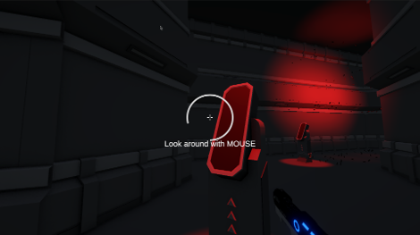

# SuperWarm

A first-person shooter built in Unity, where survival depends on speed, timing, and constant movement toward the next portal. Enemies drain your time; killing them restores it.

Inspired by [SUPERHOT](https://superhotgame.com/) — most notably its time-tied-to-movement concept, adapted here into a countdown-timer survival mechanic.

Solo project.

## Trailer

**[Download the game (.exe, Google Drive)](https://drive.google.com/file/d/1VLiBsSZer9RLrQGIEVoBaKYeExhjyMfZ/view?usp=sharing)**

<!--
TODO: Add 2-3 gameplay screenshots here, e.g.:

-->

## Overview

The player moves through enemy-controlled levels, fighting through combat spaces and racing a countdown timer. Reaching each level's portal advances the run; letting the timer hit zero ends it. The game opens with a guided in-world tutorial, continues through two levels of increasing difficulty, and ends with a victory screen showing total deaths and completion time.

## Core systems

- **Movement & camera** — First-person shooter with a first-person/third-person camera switch, introduced during the tutorial
- **Time system** — A countdown timer drives the core pressure; killing enemies restores time
- **Combat** — Projectile-based shooting against enemies
- **Enemy AI** — NavMesh-driven enemies with Patrol, Combat, and Investigate states, visually indicated by status icons
- **Interaction** — World objects are highlighted for interaction, including a hinge-physics door in the tutorial
- **Progression** — Level 2 introduces shortcuts and hidden teleport checkpoints so players can resume from meaningful progress after failure
- **Persistence** — Death count and total time are tracked across the run and shown on the victory screen

## Level flow

1. **Main Menu** — entry point into the game
2. **Tutorial** — teaches movement, camera control, the slow-motion mechanic, object interaction, shooting, and the time system through in-world guidance
3. **Level 1** — first full combat/traversal level
4. **Level 2** — larger, harder level with shortcuts and hidden checkpoint teleports
5. **Victory** — end-of-run screen showing death count and total time

## Tech stack

| Layer | Tech |
|---|---|
| Engine | Unity |
| Language | C# |
| Input | Unity's New Input System |
| AI | NavMesh, finite-state enemy behavior |
| Physics | Unity physics (hinge joints, triggers, collisions) |
